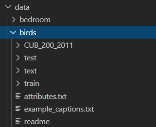

# Stack-Wasserstein and Mutual-Information

高级计算机视觉课程实验代码

根据文本生成图片, 源于基础StackGAN: [StackGAN-v2](https://github.com/hanzhanggit/StackGAN-v2)

## 安装依赖

python > 3

- 需要使用到的库已经放在requirements.txt，使用pip安装的可以使用指令  
`pip install -r requirements.txt`
- 如果国内安装第三方库比较慢，可以使用以下指令进行清华源加速
`pip install -r requirements.txt -i https://pypi.tuna.tsinghua.edu.cn/simple/`

## 下载数据

### 词向量数据

下载char-CNN-RNN基于字符级别词向量

下载地址: [https://drive.google.com/open?id=0B3y_msrWZaXLT1BZdVdycDY5TEE](https://drive.google.com/open?id=0B3y_msrWZaXLT1BZdVdycDY5TEE)

放置于 /data/birds/ , 把 text_c10 文件夹 重命名为 text

### 图片数据

下载鸟类图片, 选择All Images and Annotations

[http://www.vision.caltech.edu/visipedia/CUB-200-2011.html](http://www.vision.caltech.edu/visipedia/CUB-200-2011.html)

解压后文件夹名字为CUB_200_2011, 同样放置于 /data/birds

最终放置数据目录如图

## 训练

训练结果, 如果没有GPU, 去掉--gpu 0参数

`python code/main.py --cfg code/cfg/birds_3stages.yml --gpu 0`

## 测试

训练完成会在output文件夹保存对应model 

code/cfg/eval_birds.yml中有定义model路径

如: `./models/birds_3stages/netG_210000.pth`

然后执行测试命令即可

`python code/main.py --cfg cfg/eval_birds.yml --gpu 1`

## 结果

